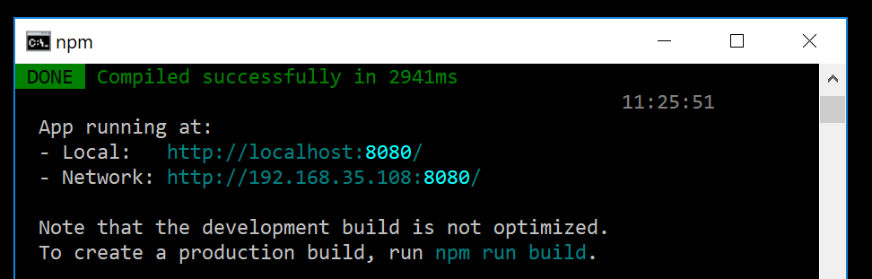

# Vue.js-ASP.NET-MVC-intergration
How to integrate Vue.js into an existing ASP.Net MVC (not Core!) application (including development integration)

## Motivation

Imaging one has an existing ASP.NET MVC project and wants to add some Vue.js components to it. One would like to keep the sources for the MVC and the Vue.js parts in a single solution and of course get the MVC application updated after some change in the Vue.js components occurs without manual copy of files between the solution folders.

I will show a working solution for a simple straightforward setup (with almost no constraints). 

## The Scenario

We will start with an empty Asp.Net MVC Project. Then we will add only one trivial controller/action/view. Simultaneously we will setup a new Vue.js project and add it to the same Visual Studio solution. We will use the Vue.js CLI for that and we will build a multipage project (multiple entry points) - with two different pages (components). At the end we will integrate this 2 Vue.js components into the MVC view we created at the start.

## Software Versions

At the time of writing I have Visual Studio Professional 2017/ Version 15.9.11 with .NET 4.7 and Vue.js CLI 3.7.0 and Vue.js 2.6.10.

## The ASP.NET MVC Project


The we add `MVC 5 Controller - Empty` to the `Controllers` folder. We name it `HomeController` and leave the generated code as it is:
```csharp
using System;
using System.Collections.Generic;
using System.Linq;
using System.Web;
using System.Web.Mvc;

namespace MVC_Vuejs.Controllers
{
    public class HomeController : Controller
    {
        // GET: Home
        public ActionResult Index()
        {
            return View();
        }
    }
}
```

The reason behind the name `HomeController` is that this is the name of the `Default` route in the `RouteConfig.cs`. So in this way the `Index` action will be automatically executed when the website is opened in the browser without  further configuration.

Further we define the view for the `Index` action. Just right-click inside the `Index()` method and select `Add View ...`:


We will keep the view simple:

```razor
<!DOCTYPE html>

<html>
<head>
    <meta name="viewport" content="width=device-width" />
    <title>ASP.NET MVC  and Vue.js Integration</title>
</head>
<body>
    <h1>ASP.NET MVC  and Vue.js Integration</h1>
</body>
</html>
```

And so we are ready on the ASP.NET MVC part:


## Adding the Vue.js Project

Here I assume you have `Vue.js` and `Vue.js CLI` already installed.

Open the command line and navigate to the `<<solution/project>>` folder (... `MVC_Vuejs/MVC_Vuejs`). We would like to have the Vue.js project inside it. It's name would be `vuejs_src`. So we create the Vue.js project there using the Vue.js CLI:

```
vue create vuejs_src
```


I would select the defaults here, but you may configure the Vue.js project as you needed it and then:
- run on the command line `cd vuejs_src`
- run `npm run serve`
- the result should be  something like: 

Now if you navigate to `http://localhost:8080/` you should be able to see the Vue.js default `Hello World` page.

Good to notice is that the Vue.js project comes with all kinds of extras like `.gitignore` file. So it is ready to be included in the Visual Studio solution. There you should click on the `Show All Files` button (in the toolbar on the `Solution Explorer`).

> **WARNING**: When adding the vuejs_src folder to the project DO NOT RIGHT-CLICK on the `vuejs_src` folder -> `Include In Project`! - there is a bug ot something and Visual Studio freezes. Maybe because of the size of the `node_modules` folder.

We do not need to include the `node_modules` folder into the solution anyways, so just right-click any file or subfolder in `vuejs_src` other than `node_modules` and select `Include In Project`. (at the time of writing they are only 7 so it is not a big deal)

So now we have the Vue.js project integrated into our ASP.NET MVC solution. Next we create some Vuejs components there and use them from the ASP.NET MVC view we created earlier.

## Create the Vuejs Components and Configure the Vuejs Project

> When developing Vue.js projects I prefer to use Visualt Studio Code (instead of Visual Studio alone). There is no problem to do so in the workflow described here. In your file explorer you just right-click on the vuejs_src folder and select `Open with Code`. From then on you can work with both editors. Normally I work in Visual Studio for ASP.NET MVC controllers/views and C# code and in Visual Studio Code for Vue.js/Javascript code. 

### Workflow Description (what exactly are we trying to achieve?)

So imagine now we have an existing ASP.NET MVC project and we would like to add some nice new Vue.js components into it. We will develop these new components inside the `vuejs_src` project and put them ready for use to the ASP.NET MVC project.

So here particularly we will create two extremly simple Vue.js components named `Feature1` and `Feature2`. We will configure the Vue.js project to build multiple components (`*.js` files) to a dedicated solution `vuejs` folder. From there on the ASP.NET MVC view files (or any html files from the solution) will be able to reference and use these Vue.js components.

> As you surely know Vue.js has development and production mode. We would like to keep using these and furthermore we would like to be able to build development versions of our Vue.js components so we can use the Vue.js developer tools in the browser while we are running the components in the ASP.NET MVC views. So we have 3 modes:
> 1) Vue.js development mode (this is the Vue.js CLI local development server with hot reload) - here we do not use the ASP.NET MVC at all!
> 2) Vue.js development components integrated into the ASP.NET MVC views
> 3) Vue.js components in production mode integrated into the ASP.NET MVC views


