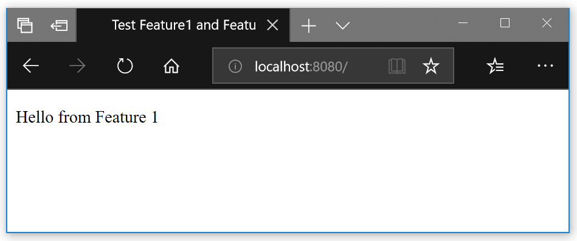
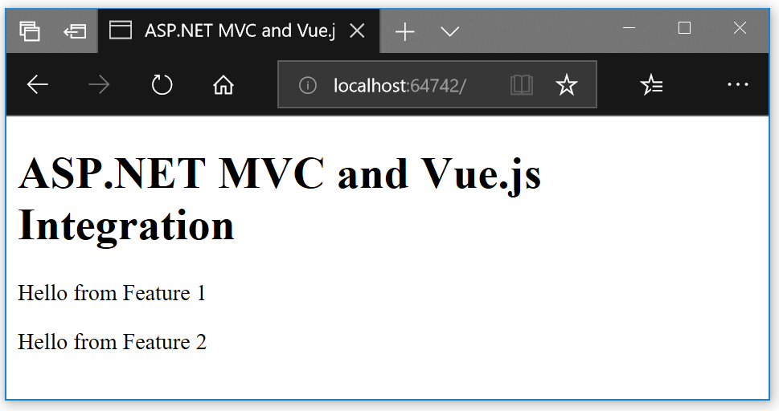
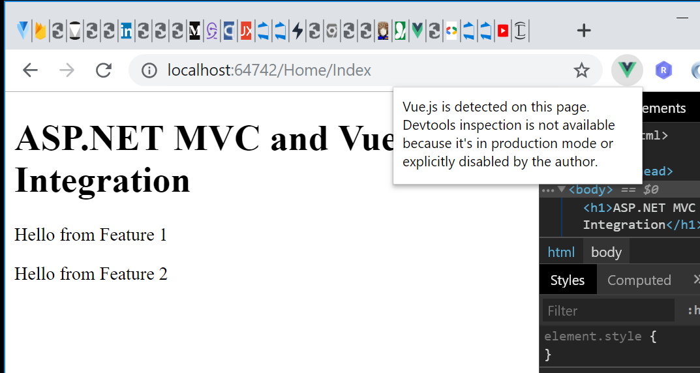
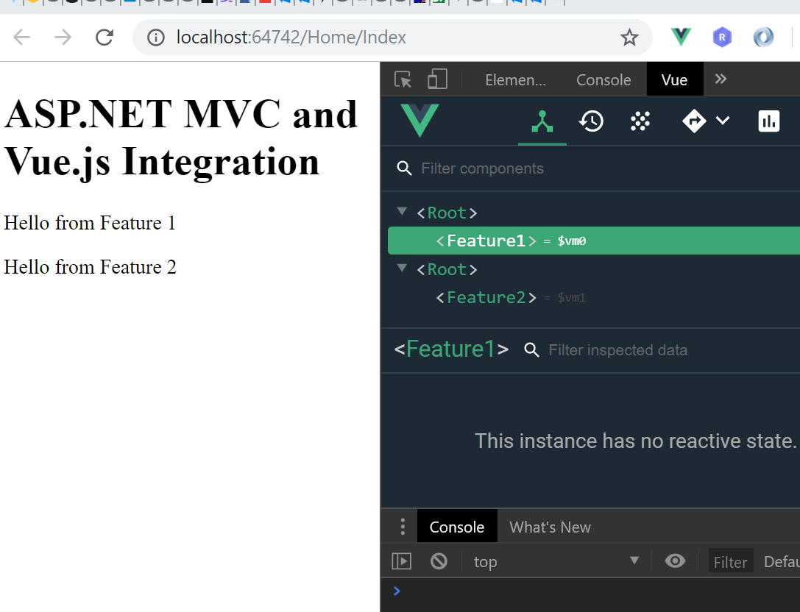

# Vue.js ASP.NET MVC Intergration
How to integrate Vue.js into an existing ASP.Net MVC (not Core!) application (including development integration)

## Motivation

Imagine one has an existing ASP.NET MVC project and wants to add some Vue.js components to it. One would like to keep the sources for the MVC and the Vue.js parts in a single solution and of course get the MVC application updated after some change in the Vue.js components occurs without manual copy of files between the solution folders.

I will show a working solution for a simple straightforward setup (with almost no constraints). 

## The Scenario

We will start with an empty Asp.Net MVC Project. Then we will add only one trivial controller/action/view. Simultaneously we will setup a new Vue.js project and add it to the same Visual Studio solution. We will use the Vue.js CLI for that and we will build a multipage project (multiple entry points) - with two different pages (components). At the end we will integrate this 2 Vue.js components into the MVC view we created at the start.

## Software Versions

At the time of writing I have Visual Studio Professional 2017/ Version 15.9.11 with .NET 4.7 and Vue.js CLI 3.7.0 and Vue.js 2.6.10.

## The ASP.NET MVC Project


Then we add `MVC 5 Controller - Empty` to the `Controllers` folder. We name it `HomeController` and leave the generated code as it is:
```csharp
using System;
using System.Collections.Generic;
using System.Linq;
using System.Web;
using System.Web.Mvc;

namespace MVC_Vuejs.Controllers
{
    public class HomeController : Controller
    {
        // GET: Home
        public ActionResult Index()
        {
            return View();
        }
    }
}
```

The reason behind the name `HomeController` is that this is the name of the `Default` route in the `RouteConfig.cs`. So in this way the `Index` action will be automatically executed when the website is opened in the browser without  further configuration.

Further we define the view for the `Index` action. Just right-click inside the `Index()` method and select `Add View ...`:


We will keep the view simple:

```razor
<!DOCTYPE html>

<html>
<head>
    <meta name="viewport" content="width=device-width" />
    <title>ASP.NET MVC  and Vue.js Integration</title>
</head>
<body>
    <h1>ASP.NET MVC  and Vue.js Integration</h1>
</body>
</html>
```

And so we are ready on the ASP.NET MVC part:


## Adding the Vue.js Project

Here I assume you have `Vue.js` and `Vue.js CLI` already installed.

Open the command line and navigate to the `<<solution/project>>` folder (... `MVC_Vuejs/MVC_Vuejs`). We would like to have the Vue.js project inside it. It's name would be `vuejs_src`. So we create the Vue.js project there using the Vue.js CLI:

```
vue create vuejs_src
```


I would select the defaults here, but you may configure the Vue.js project as you need it and then:
- run on the command line `cd vuejs_src`
- run `npm run serve`
- the result should be  something like: 

Now if you navigate to `http://localhost:8080/` you should be able to see the Vue.js default `Hello World` page.

Good to notice is that the Vue.js project comes with all kinds of extras like `.gitignore` file. So it is ready to be included in the Visual Studio solution. There you should click on the `Show All Files` button (in the toolbar on the `Solution Explorer`).

> **WARNING**: When adding the vuejs_src folder to the project DO NOT RIGHT-CLICK on the `vuejs_src` folder -> `Include In Project`! - there is a bug ot something and Visual Studio freezes. Maybe because of the size of the `node_modules` folder.

We do not need to include the `node_modules` folder into the solution anyways, so just right-click any file or subfolder in `vuejs_src` other than `node_modules` and select `Include In Project`. (at the time of writing they are only 7 so it is not a big deal)

So now we have the Vue.js project integrated into our ASP.NET MVC solution. Next we create some Vuejs components there and use them from the ASP.NET MVC view we created earlier.

## Create the Vuejs Components and Configure the Vuejs Project

> When developing Vue.js projects I prefer to use Visual Studio Code (instead of Visual Studio alone). There is no problem to do so in the workflow described here. In your file explorer you just right-click on the vuejs_src folder and select `Open with Code`. From then on you can work with both editors. Normally I work in Visual Studio for ASP.NET MVC controllers/views and C# code and in Visual Studio Code for Vue.js/Javascript code. 

### Workflow Description (what exactly are we trying to achieve?)

So imagine now we have an existing ASP.NET MVC project and we would like to add some nice new Vue.js components into it. We will develop these new components inside the `vuejs_src` project and put them ready for use to the ASP.NET MVC project.

So here particularly we will create two extremely simple Vue.js components named `Feature1` and `Feature2`. We will configure the Vue.js project to build multiple components (`*.js` files) to a dedicated solution `vuejs` folder. From there on the ASP.NET MVC view files (or any html files from the solution) will be able to reference and use these Vue.js components.

> As you surely know Vue.js has development and production mode. We would like to keep using these and furthermore we would like to be able to build development versions of our Vue.js components so we can use the Vue.js developer tools in the browser while we are running the components in the ASP.NET MVC views. So we have 3 modes:
> 1) Vue.js development mode (this is the Vue.js CLI local development server with hot reload) - here we do not use the ASP.NET MVC at all!
> 2) Vue.js development components integrated into the ASP.NET MVC views
> 3) Vue.js components in production mode integrated into the ASP.NET MVC views

### Creating the Example Feature1 and Feature2 Vue.js Components

These will be trivial components just showing a string. In the folder `vuejs_src/src` we create `Feature1.vue`:
```vue.js
// vuejs_src/src/Feature1.vue
<template>
  <p>
    Hello from Feature 1
  </p>
</template>

<script>
</script>

<style>
</style>
```

And similarly the `Feature2.vue`.

After that we create 2 Javascript files which load the Feature1.vue and Feature2.vue. In the folder `vuejs_src/src` we create `f1.js`:
```javascript
// vuejs_src/src/f1.js
import Vue from 'vue'
import F1 from './Feature1.vue'

Vue.config.productionTip = false

new Vue({
  render: h => h(F1),
}).$mount('#f1App')
```

And similarly the `f2.js` (notice `f1 -> f2` and `#f1App -> #f2App`).

### Clear the Vue.js Project from the Default Files

In order to keep the example as simple as possible we may clear the default files created from Vue.js CLI template.
These are `main.js`, `App.vue`, the whole content of the `components`, `assets` and `public` folders.

### Setting up Mode 1 (Vue.js Development Mode with the Live Server)

We have just deleted one important file - the `public/index.html`. Vue.js uses it as template wenn building the project. So let's create templates that suit our needs:

```html
<!-- public/featureTest1.html -->
<!DOCTYPE html>
<html lang="en">
  <head>
    <meta charset="utf-8">
    <meta http-equiv="X-UA-Compatible" content="IE=edge">
    <meta name="viewport" content="width=device-width,initial-scale=1.0">
    <title>Test Feature1</title>
  </head>
  <body>
    <noscript>
      <strong>We're sorry but vuejs_src doesn't work properly without JavaScript enabled. Please enable it to continue.</strong>
    </noscript>
    <div id="f1App"></div>
  </body>
</html>
```

Similarly we create `featureTest2.html`. Note that `f1App`and `f2App` correspond to the mounting points of the `Feature1` and `Feature2` components.

We changed the name of the default template from `index.html` to `featureTest[1/2].html` so now we have to tell to Vue.js to use the new templates. For that we need configuration file - we create `vuejs_src/vue.config.js`:

```javascript
//vuejs_src/vue.config.js
module.exports = {
    pages: {
        feature1: {
            entry: 'src/f1.js',
            template: 'public/featureTest1.html',
            filename: 'index.html',
            title: 'Feature 1',
            chunks: ['chunk-vendors', 'chunk-common', 'feature1']
        },
        feature2: {
            entry: 'src/f2.js',
            template: 'public/featureTest2.html',
            filename: 'index2.html',
            title: 'Feature 2',
            chunks: ['chunk-vendors', 'chunk-common', 'feature2']
        }
    }
}
```

So now if we run `npm run serve` and start web browser we will see:



Loading `http://localhost:8080/index1.html` gives the same result. If we want to check the `Feature2` component we load `http://localhost:8080/index2.html`.

You can manipulate the `filename` options in the `vue.config.js` to get the `Feature2` component loaded as default (`index.html`) or whatever other way you may want.

### Setting up Mode 3 (or Integrate the Production Versions of Feature1 and Feature2 in ASP.NET MVC View)

First we have to add some options to the `vue.config.js`:
```javascript
module.exports = {
    filenameHashing: false,
    productionSourceMap: false,
    outputDir: '../vuejs/',
    configureWebpack: {
        devtool: 'source-map',
        output: {
            filename: '[name].js'
        }
    },
    pages: {
        hanakoFeature1: {
            entry: 'src/hf1.js',
            template: 'public/hanako_feature.html',
            filename: 'index1.html',
            title: 'Hanako Feature 1',
            chunks: ['chunk-vendors', 'chunk-common', 'hanakoFeature1']
        },
        hanakoFeature2: {
            entry: 'src/hf2.js',
            template: 'public/hanako_feature.html',
            filename: 'index.html',
            title: 'Hanako Feature 2',
            chunks: ['chunk-vendors', 'chunk-common', 'hanakoFeature2']
        }
    }
}
```
**Notes:**

- `filenameHashing` - currently Vue.js CLI cannot use the `filenameHashing` feature when the template is not the `index.html`. On the other hand we want all things running automatically when integrating into an ASP.NET MVC view. If the hash changes on every `vuejs_src` project build, one has to change the `src` parameter in the view on every `vuejs_src` build. At the moment I do not know if it is possible in Vue.js to use constant hashes and how to use hashes without the `index.html` template. This would be a point for improvement.

- `outputDir` - this is the dedicated folder where the ready to use `Feature1` and `Feature2` components will be placed after the `vuejs_src` project build. After a successful build we can include this folder to the solution and also to the source control system.

If you do not specify the `outputDir` you will get everything in the `vuejs_src/dist` folder by default

So now let's build the components:
```
npm run build
```

If you go to the `../vuejs/` folder you will find `feature1.js`, `feature2.js` and the `*.html` files generated from the templates. Currently I do not know how/if one can suppress their creation. There is one more file created `js/chunk-vendors.js`. I do not know how to configure  the Vue.js CLI to put this file along with the others and not under the `js/` folder. Anyway it is not really big limitation.

Next we go to the ASP.NET MVC view file we created earlier and we add to it:
```razor
<!DOCTYPE html>

<html>
<head>
    <meta name="viewport" content="width=device-width" />
    <title>ASP.NET MVC  and Vue.js Integration</title>

    <link href="~/vuejs/feature1.js" rel=preload as=script>
    <link href="~/vuejs/feature2.js" rel=preload as=script>
    <link href="~/vuejs/js/chunk-vendors.js" rel=preload as=script>
</head>
<body>
    <h1>ASP.NET MVC  and Vue.js Integration</h1>

    <noscript><strong>We're sorry but vuejs_src doesn't work properly without JavaScript enabled. Please enable it to continue.</strong></noscript>

    <div id=f1App></div>
    <div id=f2App></div>

    <script src="~/vuejs/js/chunk-vendors.js"></script>
    <script src="~/vuejs/feature1.js"></script>
    <script src="~/vuejs/feature2.js"></script>

</body>
</html>
```

Now we can start the ASP.NET MVC application we created and voilà:



Note that if you want to debug the application in the browser using the Vue.js developer tools you won't be able to do so, because we builded the components in production mode.



So let's enable that in the next step.

### Setting up Mode 2 (or Integrate the Developer Versions of Feature1 and Feature2 in ASP.NET MVC View)

We only have to create one additional build step to do so. To acheive it we add new `build:dev` command to our `vuejs_src/package.json`:

```json
{
  "name": "vuejs_src",
  "version": "0.1.0",
  "private": true,
  "scripts": {
    "serve": "vue-cli-service serve",
    "build": "vue-cli-service build",
--> "build:dev": "vue-cli-service build src/f1.js src/f2.js --mode development",
    "lint": "vue-cli-service lint"
  },
  "dependencies": {
  ...
}

```

There is another small inconvenience here to fix. The result of this new command:
```
npm run build:dev
```
are only the `feature1.js` and `feature2.js` components (much bigger in size!). So we have to comment the lines in the ASP.NET MVC view file for the `chunk-vendors.js` - otherwise the browser will show `404 Not Found` error. But after that you only have to reaload the page (`Ctrl+F5`) and there it is - the Vue.js developer tools work now perfectly:



